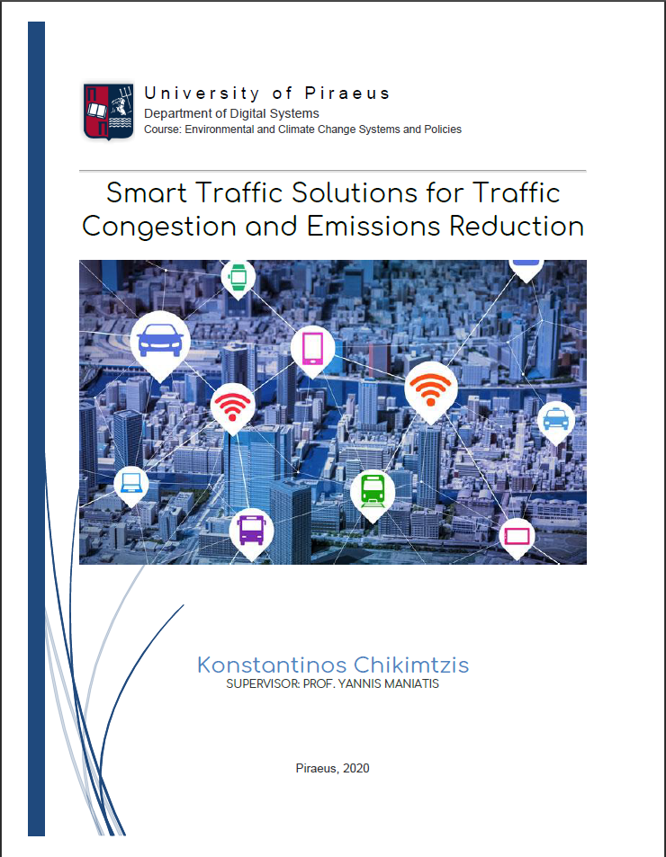

# Smart Traffic Solutions for Traffic Congestion and Emissions Reduction

## Abstract

Climate change is happening and that is now a fact. Scientific evidence for warming of the climate system is unequivocal. Last year (2019) was the second hottest year on record and that came with a lot of damages. From people losing their lives to economies taking a massive hit, all within a summer. The need for implementing green technologies is greater than ever before and we shall all take action. EU made a very big step ahead by setting the target to become the world’s first climate-neutral continent by 2050 by presenting the European Green Deal at the end of 2019. Additionally, the great advancements in the Information Technology field like AI and 5G provide us with the right toolset to initiate this green plan.
Cities play a big role when it comes to climate change because of the massive amounts of emissions they produce. Building cities that are green, inclusive and sustainable should be the foundation of any local and national climate change agenda. With urbanization increasing, we should definitely be looking to upgrading our cities and making them more pleasant for us and more environmental-friendly. This paper focuses on smart traffic management solutions in order to reduce greenhouse gasses emitted by cities and tackle traffic congestion. Furthermore, this paper studies some common techniques to implement a smart traffic management system and eventually investigates some use cases of smart traffic there are today.
In conclusion, these analyses showed that smart traffic management systems drastically reduce emissions and additionally improve our quality of transportation by making our commutes much more pleasant.

## Table of Contents

    
The Problem

    
Climate Crisis

    
Greenhouse Gasses

    
The Urbanazation Problem

    
Urban Mobility

    
Congestion

    
Air Pollution & CO2

    
Overall

